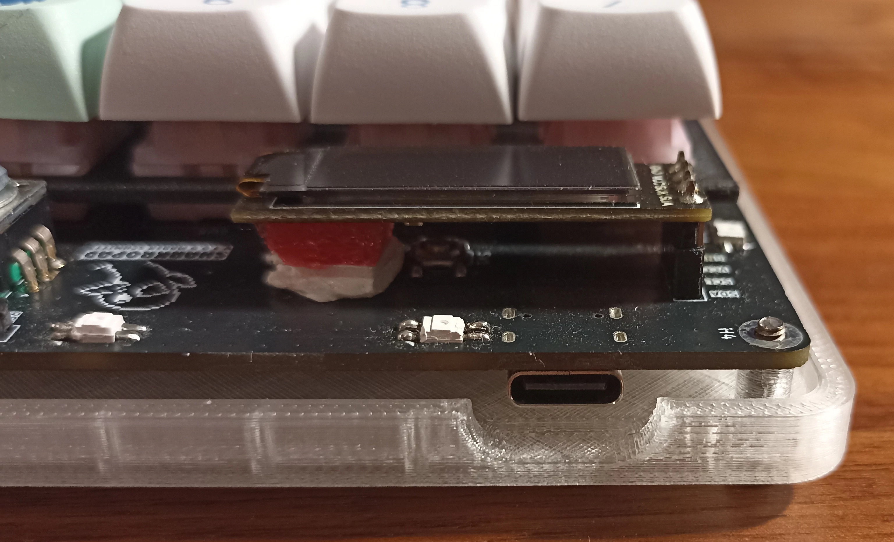
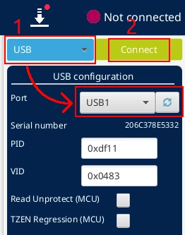

# Sharkropad

**Sharkropad** is an open-source hotswappable macropad supporting QMK.

This repository includes a custom pcb design, a 3d printed case and QMK firmware.


## Features
- **USB-C with ESD Protection**
- **Rotary Encoder**
- **OLED Display**
- **Customizable RGB Lighting**
- **Hot-Swappable Switches**
- **Powered by a STM32L432 MCU**

## Getting Started

### Pcb

The Sharkropad is based on a custom pcb. You can find the manufacturing files in the latest release.

I got my pcb manufactured and assembled from [JLCPCB](https://jlcpcb.com/).

In case you want to assemble the pcb yourself you can find all the needed parts in the bom in the latest release.

### Other needed parts

| Part                      | Quantity  | Link (recommendation) | Note |
|---------------------------|-----------|-----------------------|------|
| filament of your choice   | 50g       | [3djake.de](https://www.3djake.de/polymaker/polyterra-pla-charcoal-black)                   | For the top parts (I used a matte black PLA filament)
| transparent filament      | 30g       | [redline-filament.com](https://redline-filament.com/collections/pla-filament/products/premium-pla-transparent?variant=50149105041672)                  | Transparent bottom parts for the underglow
| M2.5 Heat Inserts         | 4         | [cnckitchen.store](https://cnckitchen.store/products/gewindeeinsatz-threaded-insert-m2-5-standard-100-stk-pcs)                   |
| M2.5 x 12 Screws          | 4         | [cnckitchen.store](https://cnckitchen.store/products/m2-5-screw-stainless-steel-aisi-304-low-head?variant=47945362833743)                  |
| Protective buffer         | 4         | [amazon.de](https://www.amazon.de/dp/B01N0X4Y38?ref=ppx_yo2ov_dt_b_fed_asin_title&th=1) |
| Keycaps                   | 12        | [aliexpress.com](https://de.aliexpress.com/item/1005006660909685.html?spm=a2g0o.order_list.order_list_main.15.49fc5c5fYY4A21&gatewayAdapt=glo2deu)
| Stranded wire             | 10cm      | tbd | Currently there is a problem with the pcb when using the underglow leds where a cable needs to be soldered
| Rotary Encoder            | 1         | [42keebs.eu](https://42keebs.eu/shop/parts/ec11-rotary-encoder/?attribute_type=Bourns%20(larger%20body)) | This particular one works with the case and the knob
| OLED display              | 1         | [42keebs.eu](https://42keebs.eu/shop/parts/oled-display-0-91-128x32/?attribute_pcb-colour=Black)
| OLED socket (low profile) | 1         | [42keebs.eu](https://42keebs.eu/shop/parts/low-profile-oled-sockets/) 
| Hotswap sockets           | 12        | [42keebs.eu](https://42keebs.eu/shop/parts/kailh-choc-hot-swap-sockets/) | (2 x 10 sockets)

### 3d printed case

The case consist of 4 printed parts:
- Bottom part of the case
- Top part of the case
- Plate for the switches
- Rotary Encoder Knob

I printed the parts with default print settings with a layer height of .2mm.

For the bottom part I used transparent filament to make the underglow leds shine through.

For the top part, the plate and the knob I used matte black PLA.

#### Rotary Encoder Knob

> **_NOTE:_**  The knob is currently not included in the repository because I am not sure about the licensing.

The knob can be found here: [Encoder Knob by VOID](https://www.printables.com/model/347536-encoder-knob/files)

To make it fit properly you need to perform a cut at 14.60 mm and only keep the bottom part as shown here in Prusa Slicer:


### Building the Sharkropad

1. Get a PCB and prepare it by soldering the components onto it (if not already done through SMT assembly)
2. Assemble the rotary encoder, the oled socket and the hotswap sockets (if not already done)
3. Fix the issue with the pcb as shown in [this chapter](#fixing-the-pcb)

    <div style="display: flex;">
        
        
    </div>

4. Place a foam (as shown) to support the OLED and mount the oled:

     

5. Assemble the switches (put the plate between pcb and switches) and the keycaps
6. Insert the heat inserts into the holes provided in the top part:

    

7. Put the protective buffers on the bottom case to prevent the macropad from sliding around:

    

8. Screw the case together with the pcb in between and put the knob on the rotary encoder

### Flashing the firmware

> **_NOTE:_** Once the firmware is flashed once you can enter bootloader mode by disconnecting the macropad, pressing and holding the encoder knob while plugging it back in. Then the macropad is in bootloader mode and you can connect to it  and program it using the CubeProgrammer or flash using QMK.

1. Get the provided firmware in the latest release
2. Flash the firmware using the [STM32 CubeProgrammer](https://www.st.com/en/development-tools/stm32cubeprog.html) as shown below:




#### Flash using QMK

As the firmware is not currently in the qmk github repository flashing with QMK is more complicated.
- You need to setup your QMK Environment
- Copy the firmware into the QMK folder:
    - Copy the contents of the firmware folder to a folder named `sharkropad` under `qmk_firmware/keyboards`
    - Target structure: `qmk_firmware/keyboards/sharkropad`:

      
- You can then compile and flash using qmk:
    ```shell
    qmk compile -kb sharkropad -km default
    qmk flash -kb sharkropad -km default
    ```

### Fixing the pcb

In the current design of the pcb, the rgb underglow and the rgb matrix for the keys are connected to different Output pins of the STM32.
However that is not supported by QMK. Therefore a cable needs to be manually soldered to also make the rgb underglow working:
- Remove the resistor R10
- Solder a cable from the left contact of R10 to the bottom contact of R13

    

## License

This project is licensed under the GNU General Public License v3.0. See the [LICENSE](LICENSE) file for details.

This project includes third-party components (libraries and fonts) that are licensed under their respective terms. These components are not covered by the GPLv3 license of this project. Users must adhere to the specific licenses provided in the respective directories.

### Libraries used for the pcb

For the creation of the pcb various libraries where used. 

A copy of most of them are included in this project to make the kicad project work without manually installing those libraries. 

Those libraries are stored under [/electronics/lib/](/electronics/lib/).

The libraries are licensed under their respective license. Please be aware of the `README.md` and `LICENSE.md` files in the lib folder.

### Font used on the pcb

The font used under the logo on the pcb is [Cherry Bomb One](https://github.com/satsuyako/CherryBomb).

A copy of the font is kept under [_assets/Cherry_Bomb_One](_assets/Cherry_Bomb_One). 
To make the font display correctly in KiCad you need to install it on your OS.

This font itself is licensed under the original OFL-1.1 License.
Please be aware of the License: [OFL.txt](_assets/Cherry_Bomb_One/OFL.txt)